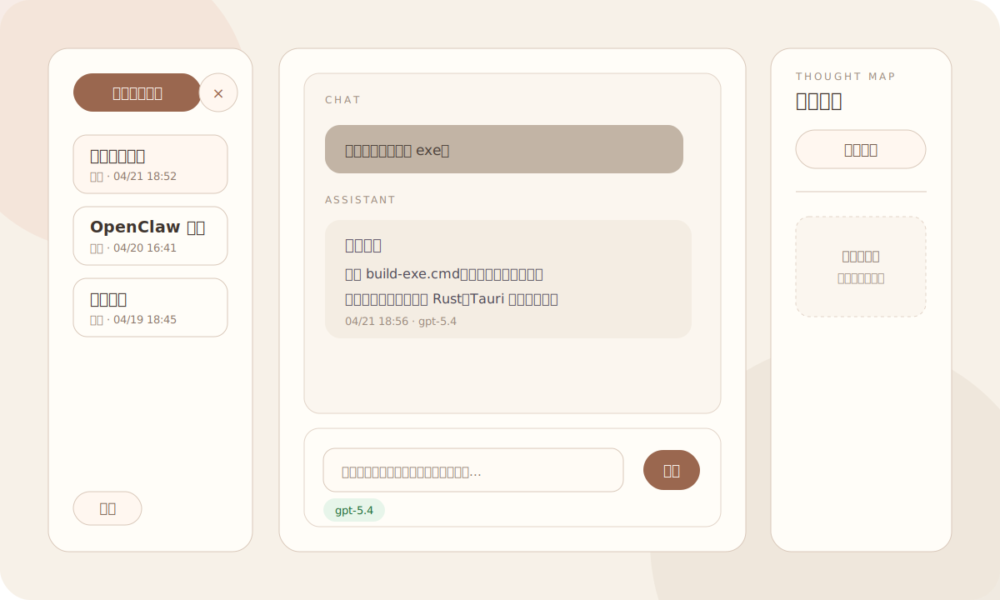

# 回答者

**回答者** 是一个本地运行的桌面 AI 问答工具，面向高频提问、边学边做、容易被零碎问题打断的人。

它解决的不是“再做一个聊天框”，而是一个更具体的问题：

> 让临时问题、连续追问、本地笔记和历史对话待在同一个轻量工作台里，减少上下文混乱。

## 界面预览



## 核心亮点

- **多对话窗口**：左侧可以创建多个对话窗口，把不同主题分开，避免一个聊天窗口越聊越乱。
- **单点 / 记忆两种模式**：单点适合查零碎知识；记忆适合围绕同一件事连续追问。
- **本地历史保存**：问答记录保存在本机 SQLite，不依赖云端历史。
- **本地笔记工具**：当你说“帮我记一下”时，可以写入本地 `note.json`；当你说“去笔记里找”时，可以搜索本地笔记。
- **主模型可切换**：主问答模型支持在 `gpt-5.4` 和 `gpt-5.5` 之间切换。
- **失败兜底**：主模型请求失败时，会自动重试并尝试切换到轻量模型，减少一次失败就卡住的情况。
- **模型日志可查**：本地保留模型调用日志，方便排查请求体、响应字段和报错原因。

## 它适合什么场景

- 学习一个新技术时，随手问很多小问题。
- 做项目时，需要把“临时查一下”和“围绕当前任务连续追问”分开。
- 想保留自己的问答记录，但不想把所有内容都散落在不同网页聊天窗口里。
- 想让 AI 帮自己记一点本地笔记，并能之后再找回来。

## 基本使用

1. 运行应用。
2. 在设置里填写 `API URL` 和 `API Key`。
3. 点击左侧“新增对话窗口”。
4. 选择对话模式：
   - `单点`：每个问题互不关联，适合零碎查询。
   - `记忆`：保留当前窗口上下文，适合连续追问。
5. 在底部输入问题并发送。
6. 如果需要保存信息，可以说“帮我记一下……”。
7. 如果需要查笔记，可以说“去笔记里找……”。

## 启动方式

开发运行：

```bat
.\start.cmd
```

打包桌面程序：

```bat
.\build-exe.cmd
```

打包后的程序默认在：

```text
src-tauri\target\release\local-qa-window.exe
```

## 本地数据

回答者默认把运行数据保存在本机应用数据目录，包括：

- `settings.json`：接口配置，可能包含 API Key。
- `qa_records.db`：本地问答历史。
- `model_calls.jsonl`：模型调用日志。
- `note.json`：本地笔记。

这些隐私文件默认不会上传到 GitHub。

## 当前说明

右侧“思维地图 / 知识地图”区域当前只保留占位。旧版逻辑已经停用，后续会重新设计，不作为当前稳定功能介绍。
